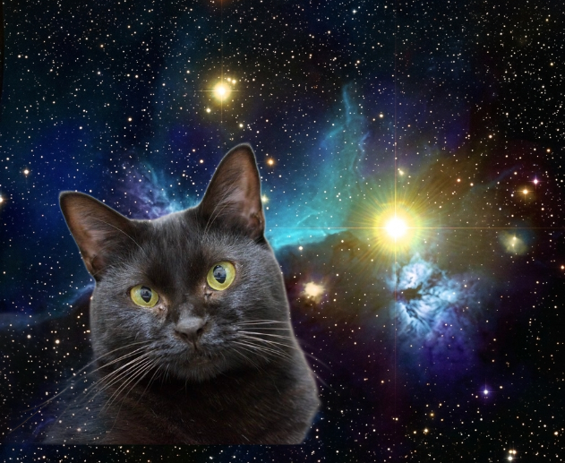

# Space Cat - 宇宙猫ジェネレーター

写真を選ぶだけで「宇宙猫」画像が作れるWebアプリ。



**[使ってみる →](https://jin112343.github.io/SpaceCat/)**

## 使い方

1. 写真を選ぶ
2. AIが自動で背景除去
3. 宇宙背景と合成
4. 保存・シェア

## 特徴

- ブラウザ完結（サーバーに画像を送信しません）
- スマホ対応（ピンチズーム・回転）
- 登録不要・完全無料
- サイズ・回転・切抜き調整
- X（Twitter）に画像付きシェア

## 開発

```bash
npx serve .
```

> `file://` では動作しません（ES Module CDNインポートのため）

## リンク

- [アプリを使う](https://jin112343.github.io/SpaceCat/)
- [応援する（Buy Me a Coffee）](https://buymeacoffee.com/mizoijin)

## ライセンス

AGPL-3.0-only（[@imgly/background-removal](https://github.com/imgly/background-removal-js) の要件に準拠）
